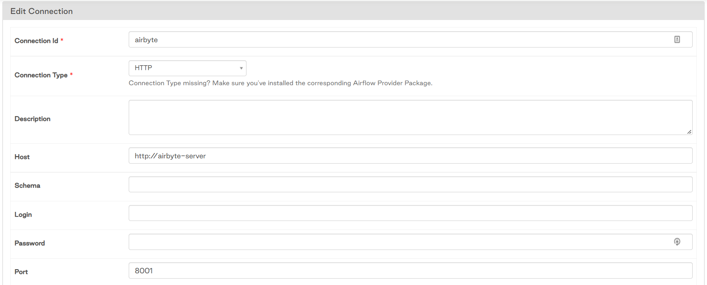
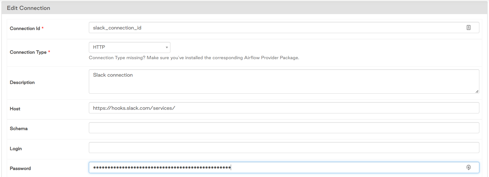

# Airflow-Airbyte-DBT
This demo project shows how to use Airflow as a task orchestrator to execute extract and load operations on Airbyte and then transformations through DBT.

## Airbyte
1. Open-source data integration tool (extract & load)
2. 140+ connectors
3. Build custom connectors
4. Very customizable

Airbyte Founder/CEO gave a [presentation](https://airflowsummit.org/sessions/2021/the-new-modern-data-stack-airbyte-airflow-dbt/) at Airflow Summit 2022 and sees Airflow/Airbyte/DBT as the new modern data stack

## Setup
1. Clone airbyte open source [repo](https://github.com/airbytehq/airbyte)
2. Run `docker-compose up` to start airbyte
3. Setup integration tasks and test the extractions
4. Setup airflow project through local deployment
    * `astro dev init`
    * `astro dev start`

### Pairing with Airflow
Airflow triggers airbyte jobs through an HTTP post. Very simple to set up.
1. Create airflow HTTP connection
2. Use `localhost:8001` as the host
3. Copy a working connection url to grab the IDs for the `AirbyteTriggerSyncOperator`
    * An airflow-airbyte operator looks like this:
    ```python
    NBA = Variable.get('airbyte_conn_nba')

    extract_nba = AirbyteTriggerSyncOperator(
        task_id='extract_nba',
        airbyte_conn_id='airbyte',
        connection_id=NBA,
        asynchronous=False,
        timeout=3600,
        wait_seconds=3
    )
    ```
    * `airbyte_conn_id` : insert your Airflow HTTP connection id here
    * `connection_id` : insert the connection id here (comes from the airbyte connection url)
    * For example: `http://localhost:8000/workspaces/80eb7904-15d5-4493-bf14-a0a8b2adea81/connections/85dd4962-e5c5-4a50-9a08-f8a4a0bad026/status`
        - Grab the id that comes immediately after the `connections/`. This is the airbyte job that airflow will trigger (`85dd4962-e5c5-4a50-9a08-f8a4a0bad026`)
        - In this project, the id is set as an airflow variable, which is then pulled into the dag as `NBA`
    * When the dag is triggered, airflow will send a `POST` request to airbyte api that will trigger the specified job
4. In theory, this should work, but due to Docker networking issues it will probably fail. Check out the [debugging](#docker-networking) section below

### Debugging
#### Docker Networking
If running both airflow and airbyte locally through Docker, you will likely bash your head against the wall like I did because the docker containers don't like to get along and talk to each other. Each is in its own default created network, so we will need to create a bridged network for the containers.
1. Make sure airflow and airbyte are up and running
2. Open up bash and run `docker network create <network name>`
3. Run ` docker ps --format "table {{.ID}}\t{{.Ports}}\t{{.Names}}"` to get the list of currently running docker containers
    - The output will look like [this](./names.txt):
    ```bash
    CONTAINER ID   PORTS                                NAMES
    42f34b1560e3   0.0.0.0:8080->8080/tcp               webserver
    5b7233ddd6a6                                        scheduler
    ba9871da883b                                        triggerer
    e3a5f1ed5cc7   6933-6935/tcp                        airbyte-temporal
    383a1a3fc566                                        airbyte-scheduler
    105c000466a3   0.0.0.0:8000->80/tcp                 airbyte-webapp
    e6a4e9342ff1                                        airbyte-worker
    895b3950cec9   8000/tcp, 0.0.0.0:8001->8001/tcp     airbyte-server
    b25eeab3ea6f   5432/tcp                             airbyte-db
    bf15ecd56bef   0.0.0.0:5432->5432/tcp               airflow_42d2c6-postgres

    ```
4. For each container you see, add it to the new docker network 
    - `docker network connect <network name> webserver` 
    - `docker network connect <network name> airbyte-server`
    - Etc
    - `TO DO:` Add in script that will create a docker network and iterate through containers and add them to that network
5. Once all the docker containers are on the same network, go to the airbyte HTTP connection in the airflow UI and update the host to be `http://airbyte-server`. The port will be `8001`
    - 

#### Airflow 2.3.0 & DBT
1. I was running into issues using DBT operators from `airflow-dbt` with Airflow 2.3.0. I'm interested in testing out the `airflow-dbt-python` package instead, but for now have a temporary fix
2. Make sure `airflow-dbt`, `dbt-snowflake` are installed on the airflow server
3. Add a `BashOperator` to `cd` into `/home/astro/.local/bin` and check if `dbt` exists in the virtual directory
    - `cd /home/astro/.local/bin && ls`
4. If it exists, add this path as a parameter in the `dbt_operators` for `dbt_bin`
    - ```python
        # DBT Run
        # /home/astro/.local/bin/dbt
        dbt_run = DbtRunOperator(
            task_id="dbt_run",
            dir="/usr/local/airflow/dags/dbt/",
            dbt_bin='/home/astro/.local/bin/dbt',
            profiles_dir='/usr/local/airflow/dags/dbt/',
            trigger_rule="all_done", # Run even if previous tasks failed
        )
        ```
5. If dbt does not exist within `/home/astro/.local/bin/dbt`, then do a one time install via a bash operator `pip3 install airflow-dbt && pip3 install dbt-snowflake`
6. Then repeat step 4. DBT operators should work now

## Other Features in this Repo
### Slack notifications
I created a slack workspace and created a webhook url through which airflow will send automated notifications upon task failure or success for a dag.

1. Create slack workspace. Get slack api key
    - `api.slack.com` and sign in
    - create a new app
    - go to Incoming Webhooks > activate webhooks > create API key and copy
    - Install additional packages (if not yet installed)
    ```requirements.txt
    apache-airflow-providers-slack
    apache-airflow-providers-slack[http]
    ```
    - Create new airflow HTTP connection. Name it slack and insert the webhook url into the `host`. The second half of the url will be put in the `password`
        - `https://hooks.slack.com/services/` - host
        - `00000000000/00000000000/0000000000000000000000` - password
        - 
2. Use `on_success_callback` and `on_failure_callback` in the `default_args` to trigger slack messages
3. We will use `BaseHook`, `SlackWebhookOperator`, and `Dag Task Instance Context` to send messages with links to airflow logs
4. ```python
    ##### Slack Alerts #####
    slack_conn_id = Variable.get('slack')

    def task_fail_slack_alert(context):
        # Called on failure
        slack_webhook_token = BaseHook.get_connection(SLACK_CONN_ID).password
        channel = BaseHook.get_connection(SLACK_CONN_ID).login
        slack_msg = f"""
            :x: Task Failed.
            *Task*: {context.get('task_instance').task_id}
            *Dag*: {context.get('task_instance').dag_id}
            *Execution Time*: {convert_datetime(context.get('execution_date'))}
            <{context.get('task_instance').log_url}|*Logs*>
        """

        slack_alert = SlackWebhookOperator(
            task_id='slack_fail',
            webhook_token=slack_webhook_token,
            message=slack_msg,
            channel=channel,
            username='airflow',
            http_conn_id=SLACK_CONN_ID
        )

        return slack_alert.execute(context=context)
    ```
5. Look at [airbyte-dag](./dags/airbyte-dag.py) to get more context for this feature

### Airflow 2.3.0
1. Introduces a new UI interface (grid view), which is so much nicer!
2. Moving towards `task_groups` instead of `subdags` -- soon to be [deprecated](https://airflow.apache.org/docs/apache-airflow/stable/concepts/dags.html?highlight=taskgroup#taskgroups-vs-subdags)
3. Add tagging to Dags
4. New decorators to clean up code (view [example-dag-basic.py](./dags/example-dag-basic.py) for examples)
5. Add DAG docs in markdown format via python DocStrings

